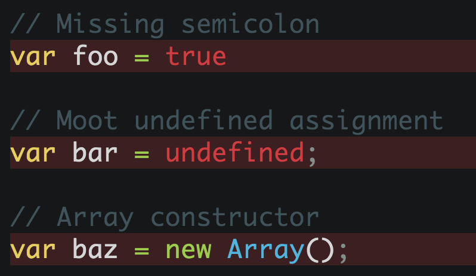

# fixmyjs

> Automagically fix JSHint lint warnings using [fixmyjs](https://github.com/jshint/fixmyjs)



*Issues with the output should be reported on the fixmyjs [issue tracker](https://github.com/jshint/fixmyjs/issues).*


## Install

```
$ apm install fixmyjs
```

Or, Settings → Install → Search for `fixmyjs`


## Usage

Open the Command Palette and type `fixmyjs`.

Can also be run on just a selection. For example the code in a `<script>` tag.


## Legacy mode

By default, this plugin uses the FixMyJS `legacy` mode. This option uses the last stable version of the module which uses JSHint to detect errors in your code and fix them.

It does not include all of the fixes the current version of FixMyJS exposes, but does do a much better job of preserving source formatting. Legacy mode can be switched off in the settings.


## Keyboard shortcut

Set the keyboard shortcut you want in your [keymap](http://flight-manual.atom.io/using-atom/sections/basic-customization/#customizing-keybindings):

```cson
'atom-text-editor':
	'cmd-shift-x': 'FixMyJS'
```


## License

MIT © [Sindre Sorhus](https://sindresorhus.com)
